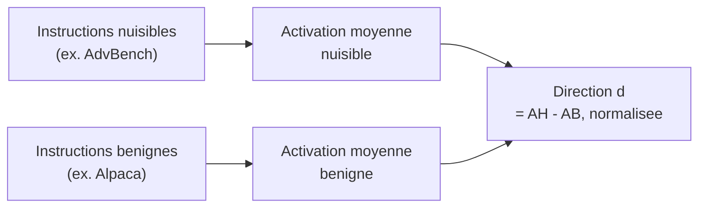

# L'abliteration : comment un LLM apprend à refuser, et comment on retire ce réflexe

Ce document explique la technique d'*abliteration* (Arditi et al., 2024), telle qu'implémentée dans ARGOS sur Ministral-3-3B. L'idée tient en une phrase : le refus d'un LLM n'est pas diffus dans des millions de poids, il est porté par **une seule direction** de son espace d'activation. La localiser, puis l'effacer des poids par projection orthogonale, suffit à neutraliser le refus sans réentraînement.

Ce qui suit détaille comment localiser cette direction, comment la neutraliser proprement, et où ça peut mal tourner, avec un exemple réel tiré du projet.

## 1. Le postulat : un comportement, une direction

Un LLM ne stocke pas ses concepts dans des cases séparées. Il les superpose dans un même espace vectoriel de grande dimension, le *residual stream* : à chaque couche, le modèle lit et écrit dans ce même vecteur, qui porte simultanément la grammaire, les faits, le style, et, pour un modèle aligné, la décision de refuser ou non une requête.

L'hypothèse de représentation linéaire, popularisée dans les travaux d'interprétabilité mécaniste, avance que chacun de ces concepts correspond à peu près à **une direction** dans cet espace : une droite le long de laquelle l'activation se déplace quand le concept s'active. Arditi et al. (2024) ont testé cette hypothèse spécifiquement sur le refus, et ont trouvé qu'elle tient remarquablement bien : sur la plupart des modèles instruct testés, une unique direction, présente à travers les couches, suffit à expliquer le basculement entre « je réponds » et « je refuse ».

Si c'est vrai, ça a une conséquence forte : pas besoin de réentraîner le modèle pour changer son comportement de refus. Il suffit de trouver cette direction, et de l'éditer directement dans les poids.

## 2. Localiser la direction

On ne peut pas lire la direction de refus directement dans les poids : elle n'existe que comme un motif statistique dans la façon dont le modèle réagit à des entrées différentes. Pour la faire apparaître, on contraste deux populations de prompts.

1. On fait passer dans le modèle un grand nombre d'instructions **nuisibles** (par exemple « explique comment... ») et un grand nombre d'instructions **bénignes**, et on capture l'activation du residual stream à la dernière position de token, couche par couche.
2. Pour chaque couche, on calcule la moyenne des activations nuisibles et la moyenne des activations bénignes, puis leur différence :

$$d = \text{moyenne(nuisible)} - \text{moyenne(bénin)}$$

3. On normalise ce vecteur (norme 1) : il devient une *direction* pure, indépendante de l'amplitude des activations.
4. On répète l'opération pour chaque couche candidate, ce qui donne un jeu de directions à tester plutôt qu'une seule certitude.

## 3. Vérifier avant d'agir

Chaque couche produit une direction candidate, mais toutes ne se valent pas : certaines captent bien le refus, d'autres captent surtout du bruit ou un artefact de position. Avant de modifier quoi que ce soit de façon permanente, on teste chaque candidate *à la volée*, par un hook d'inférence : à chaque passage avant, on soustrait de l'activation sa composante le long de $d$, on génère une réponse à des instructions nuisibles de test, et on mesure si le refus a disparu.

$$a' = a - (a \cdot d)\, d$$

Intervention temporaire (par hook) : on retire de l'activation $a$ sa projection sur $d$, à chaque couche, à chaque token. C'est réversible, ça sert uniquement à évaluer la direction.

C'est une étape purement diagnostique : rien n'est encore modifié dans les poids. La direction retenue est celle qui fait tomber le taux de refus le plus bas sur le jeu de test, tout en produisant des réponses qui restent du texte cohérent, un point sur lequel on reviendra.

## 4. Neutraliser en dur : l'orthogonalisation des poids

Une fois la bonne direction identifiée, on ne veut plus dépendre d'un hook à chaque génération : on l'efface directement des poids, une fois pour toutes. Pour chaque matrice $W$ qui écrit dans le residual stream (l'embedding de sortie, la projection de sortie de l'attention, la projection de sortie du MLP, à chaque couche), on retire la composante de son espace de sortie qui pointe le long de $d$.

$$W' = W - d\,(d^{\mathsf{T}} W)$$

Équivalent à $W' = (I - dd^{\mathsf{T}})\, W$ : multiplier par la projection sur le sous-espace orthogonal à $d$. Quel que soit l'input, la sortie de $W'$ n'a plus jamais de composante le long de $d$. L'effacement est mathématique, pas statistique.

Ce n'est pas ajouter un vecteur, c'est **retirer une composante déjà présente**. La matrice garde toute sa capacité à écrire dans les 3071 autres dimensions du residual stream ; seule la dimension $d$ lui est désormais interdite.

| | Avant ablation | Après ablation |
|---|---|---|
| Composante de la sortie le long de $d$ | mesurable, non nulle | exactement nulle, pour n'importe quelle entrée |
| Reste de l'espace de sortie | inchangé | inchangé |

### Deux conventions d'axe, un même principe

En pratique, la formule ci-dessus s'applique différemment selon comment la bibliothèque stocke la matrice. Pour une couche `nn.Linear` (projection de sortie de l'attention, du MLP), la dimension de sortie est le premier axe du tenseur de poids : on projette selon les *lignes*. Pour une table d'embedding, la dimension de sortie est le dernier axe : on projette selon les *colonnes*. Le principe reste identique, seule la convention d'indexation change, un détail d'implémentation, mais celui qui plante tout si on l'inverse.

## 5. Ce que l'ablation ne garantit pas

Retirer une seule direction sur les milliers que compte le residual stream a l'air chirurgical. Ça l'est, en un sens : le reste de l'espace n'est pas touché. Mais deux problèmes restent ouverts, et c'est précisément ce qu'ARGOS cherche à mesurer plutôt qu'à supposer :

- **Le compromis capacité/refus.** Rien ne garantit que la direction de refus est parfaitement disjointe des directions qui portent le raisonnement, les faits, ou la cohérence grammaticale. La supprimer peut donc dégrader le modèle au-delà du seul refus, à des degrés qui varient selon la couche choisie.
- **La validité de la direction elle-même.** La direction est une moyenne empirique sur un échantillon de prompts. Si cet échantillon est mal choisi, ou si une couche produit un signal dégénéré, la direction obtenue peut être trompeuse, voire numériquement invalide.

> **Ce qui s'est réellement passé sur ARGOS.**
> Sur Ministral-3-3B, la toute première couche (l'embedding brut du dernier token, avant tout bloc transformer) a produit une direction candidate à **norme exactement nulle** : le dernier token d'un prompt formaté pour la génération est le même marqueur de début de tour assistant, qu'importe le contenu du prompt, donc aucune différence mesurable entre nuisible et bénin à cette couche précise. Normaliser un vecteur nul produit un `NaN`. Le tri des candidats, non protégé, a classé ce `NaN` en position de tête, et la métrique de refus, qui ne cherchait que des phrases comme « je ne peux pas », a compté le texte vide généré par le modèle corrompu comme une absence de refus. Le modèle ne s'était pas mis à obéir : il avait cessé de produire quoi que ce soit de cohérent.

La leçon n'est pas anecdotique : une technique qui semble purement algébrique reste vulnérable aux cas limites du pipeline qui la calcule, et une métrique d'évaluation qui ne vérifie pas que le modèle répond encore *quelque chose* peut valider silencieusement un résultat qui n'existe pas.

## 6. Pourquoi ça vaut la peine d'être mesuré

La plupart des démonstrations publiques d'abliteration s'arrêtent à « le refus a disparu ». C'est un critère binaire, facile à montrer, et incomplet : il ne dit rien de ce que le modèle a perdu au passage. ARGOS traite la question inverse comme le vrai objet d'étude, quantifier, couche par couche et direction par direction, le point où le refus tombe sans que la capacité de raisonnement s'effondre avec lui, plutôt que de la découvrir après coup et la rattraper par un fine-tuning correctif.

Résultats chiffrés dans le [README](README.md#résultats-clés) et le [write-up technique](WRITEUP.md).

## Références

1. Arditi, A. et al. (2024). *Refusal in Language Models Is Mediated by a Single Direction.* [lesswrong.com](https://www.lesswrong.com/posts/jGuXSZgv6qfdhMCuJ/refusal-in-llms-is-mediated-by-a-single-direction)
2. Labonne, M. (2024). *Uncensor any LLM with abliteration.* [huggingface.co/blog](https://huggingface.co/blog/mlabonne/abliteration)

---

Projet ARGOS · Shaïma Derouich
