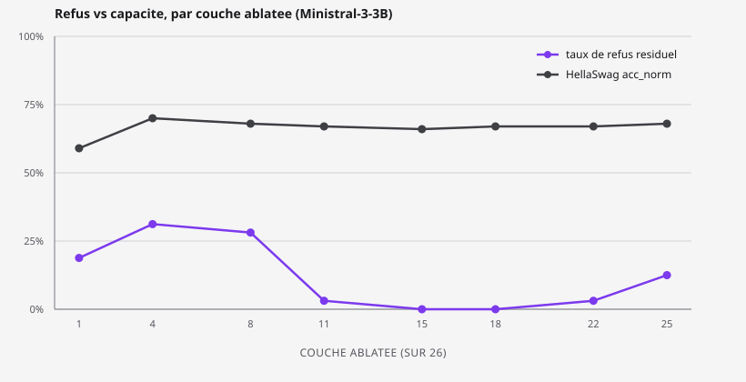
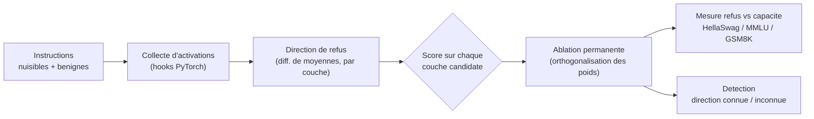

# ARGOS

**Agentic Red-teaming & Guardrail-stripped Offensive System**

[](https://github.com/shm0m/argos/actions/workflows/ci.yml)
[](LICENSE)

Un LLM refuse ou obéit selon la valeur d'**une seule direction** dans son espace d'activation. ARGOS la localise, la neutralise dans les poids d'un modèle réel (Ministral-3-3B), mesure ce que ça coûte vraiment en capacité de raisonnement, et construit les outils pour détecter qu'un modèle a subi cette opération, y compris quand on ne connaît pas la direction utilisée.

| Document | Contenu |
|---|---|
| [METHODE.md](METHODE.md) | Comment fonctionne l'abliteration, expliquée pas à pas avec les équations. |
| [WRITEUP.md](WRITEUP.md) | Le write-up technique complet : obstacles réels rencontrés et résultats chiffrés. |
| [RAPPORT.md](RAPPORT.md) | Carnet de bord : démarche, sources utilisées, ce que j'ai appris, perspectives. |

## Pourquoi ce projet

La technique d'abliteration (Arditi et al., 2024 ; popularisée par Labonne, 2024) montre qu'orthogonaliser les poids d'un modèle par rapport à cette direction unique suffit à supprimer son réflexe de refus, sans réentraînement. Les implémentations existantes s'arrêtent à la démonstration : elles suppriment le refus, constatent une perte de performance générale, et la compensent après coup par un fine-tuning correctif.

ARGOS pose la question dans l'autre sens : **peut-on caractériser et minimiser ce compromis refus/raisonnement de façon mesurable, couche par couche, plutôt que de le réparer une fois le dégât fait ?** Et côté défense : peut-on détecter qu'un modèle a été altéré, avec ou sans connaître la direction utilisée par l'attaquant ?

Modèle cible : **Ministral-3-3B-Instruct** (Mistral AI, checkpoint BF16), une architecture (`ministral3`) trop récente pour être supportée par les outils d'interprétabilité standards (TransformerLens). Ça a forcé à réécrire le pipeline sur des hooks PyTorch natifs, réutilisables sur n'importe quel modèle causal Hugging Face.

## Résultats clés

| | Modèle original | Modèle ablaté |
|---|---|---|
| Taux de refus (n=32, IC95 %) | 21,9 % [11,0 ; 38,8] | **0,0 %** [0,0 ; 10,7] |
| GSM8K exact-match (n=20) | 0,60 / 0,70 | 0,65 / 0,70 |
| HellaSwag / MMLU (n=100-150) | n/a | écarts ≤ 0,04, dans le bruit |



Balayage sur 8 couches réparties sur toute la profondeur du réseau (26 couches) : le refus dessine une courbe en cloche inversée. 19 à 31 % de refus subsiste aux couches précoces, tombe à 0 % aux couches médianes (15-18), puis remonte à 12,5 % en fin de réseau, tandis que la capacité (HellaSwag) reste quasi constante à toutes les profondeurs. Détail complet, intervalles de confiance et discussion des limites dans le [write-up](WRITEUP.md#phase-2--mesure-capacité-vs-refus-résultat-valide).

## Comment ça marche



1. **Collecte d'activations** : un jeu d'instructions nuisibles et bénignes traverse le modèle ; le residual stream (entrée/sortie de chaque couche) est capturé à la dernière position de token.
2. **Direction de refus** : différence de moyennes (nuisible − bénin) par couche, normalisée. Chaque couche produit une direction candidate.
3. **Sélection** : chaque candidate est testée par intervention temporaire (hook), la retenue est celle qui minimise le refus résiduel sans dégénérer en texte vide.
4. **Ablation** : orthogonalisation permanente des poids d'écriture (`embed_tokens`, `self_attn.o_proj`, `mlp.down_proj`, à toutes les couches) par rapport à la direction retenue.
5. **Mesure** : taux de refus résiduel **et** score de capacité, pour quantifier le compromis plutôt que le supposer.
6. **Détection** : volet défensif à deux niveaux, direction connue (projection directe) ou inconnue (comparaison de profils de normes avec un modèle de référence).

## Structure du projet

```
argos/
  cli.py              # pipeline complet : trouve la direction, ablate, sauvegarde
  data.py             # jeux d'instructions nuisibles/benignes (datasets publics)
  activations.py      # collecte du residual stream via hooks
  direction.py        # calcul des directions candidates, ablation par hook
  ablate.py            # orthogonalisation permanente des poids
  measure.py           # refus vs capacite, modele original vs ablate
  sweep.py             # balayage multi-couches (la figure signature)
  detect.py            # detection a direction connue
  detect_blind.py      # detection a direction inconnue (comparaison de profils)
  server.py            # demo de chat interactive (FastAPI)
  eval/
    refusal.py          # taux de refus, IC de Wilson, detection de texte degenere
    capability.py       # wrapper lm-eval-harness (HellaSwag/MMLU/GSM8K)
configs/ministral-3b.yaml
tests/                  # 18 tests, aucun ne necessite de GPU
METHODE.md              # comment fonctionne l'abliteration, pas a pas
WRITEUP.md              # obstacles reels rencontres et resultats, en detail
RAPPORT.md              # demarche, sources, apprentissages, perspectives
```

## Roadmap

Phases 0 à 4 terminées et validées sur GPU réel (RTX 5070 Ti, 12 Go).

- [x] Phase 0 : cadrage, structure du repo
- [x] Phase 1 : direction de refus, orthogonalisation, validée de bout en bout sur GPU
- [x] Phase 2 : mesure refus vs capacité (HellaSwag/MMLU/GSM8K) + balayage multi-couches
- [x] Phase 3 : détection d'un modèle ablaté, direction connue **et** direction inconnue
- [x] Phase 4 : packaging (CLI complète, démo interactive, CI, write-up)
- [ ] Phase 5 : calibrer la détection à direction inconnue sur plusieurs cas (taux de faux positifs)

## Éthique et cadre d'usage

Ce projet est une contribution de recherche en interprétabilité et sécurité des LLM, pas un outil prêt à l'emploi pour contourner des garde-fous en production. Les jeux d'instructions « nuisibles » utilisés proviennent d'un benchmark public existant ([mlabonne/harmful_behaviors](https://huggingface.co/datasets/mlabonne/harmful_behaviors), dérivé d'AdvBench) et servent uniquement à caractériser la direction de refus. Aucun contenu nuisible généré n'est publié dans ce dépôt. Les résultats visent à documenter la fragilité du safety fine-tuning, dans la continuité des travaux d'Arditi et al. et de Labonne.

## Installation

```bash
python -m venv .venv
source .venv/bin/activate  # ou .venv\Scripts\activate sous Windows
pip install -r requirements.txt
```

Nécessite un GPU CUDA (validé sur 12 Go de VRAM). Sous Windows, installer torch avec la roue CUDA correspondant au driver plutôt que la roue CPU par défaut de PyPI, ex. :

```bash
pip install torch --index-url https://download.pytorch.org/whl/cu130
```

## Utilisation

```bash
# Pipeline complet : trouve la meilleure direction et sauvegarde le modele ablate
python -m argos.cli --config configs/ministral-3b.yaml --output results/ablated-model

# Mesure refus vs capacite, modele original vs ablate
python -m argos.measure --baseline <model_id> --ablated results/ablated-model

# Balaye plusieurs couches candidates pour tracer la courbe refus/capacite
python -m argos.sweep --n-directions 8

# Detection a direction connue (le vecteur exact ayant servi a l'ablation)
python -m argos.detect --direction results/ablated-model/refusal_direction.pt \
    --baseline <model_id> --candidate results/ablated-model

# Detection a direction inconnue : compare le profil de normes a un modele de reference
python -m argos.detect_blind --reference <model_id> --candidate results/ablated-model

# Interface de chat locale pour tester le modele ablate
python -m argos.server --model results/ablated-model
```

## Tests

```bash
pytest tests/ -q
```

18 tests, tous en logique pure (pas de GPU, pas de téléchargement de modèle) : intervalle de confiance de Wilson, exclusion des directions dégénérées/NaN, sélection de couches candidates, classification refus/détection. CI sur chaque push via GitHub Actions.

## Références

- Arditi, A. et al. (2024), [*Refusal in LLMs Is Mediated by a Single Direction*](https://www.lesswrong.com/posts/jGuXSZgv6qfdhMCuJ/refusal-in-llms-is-mediated-by-a-single-direction).
- Labonne, M. (2024), [*Uncensor any LLM with abliteration*](https://huggingface.co/blog/mlabonne/abliteration).

## Licence

MIT, voir [LICENSE](LICENSE).

---

Shaïma Derouich · [GitHub](https://github.com/shm0m) · [LinkedIn](https://www.linkedin.com/in/shaima-d)
